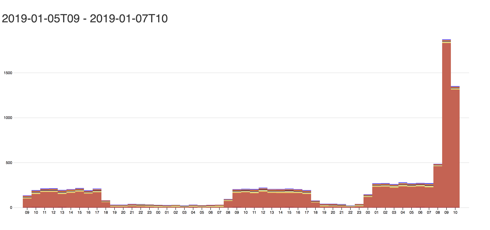

# D3 Chart and Python powered backend app to display d3 chart

*  Simple Frontend that produces stacked bar chart using D3 (d3js.org) and jquery (jquery.com)

* API to fetch chart data

## core Dependencies
* Python 3
* pipenv
* flask
* D3
* Datasource is sample.json

## Installation of packages and dependencies

 
 pipenv install
 

curl -X GET \
  http://localhost:5000/get_chart_data \
  -H 'Content-Type: application/json' \
  -H 'cache-control: no-cache'

## Chart loads at following page:

http://localhost:5000/

## command

python app.py

## screenshot attached

